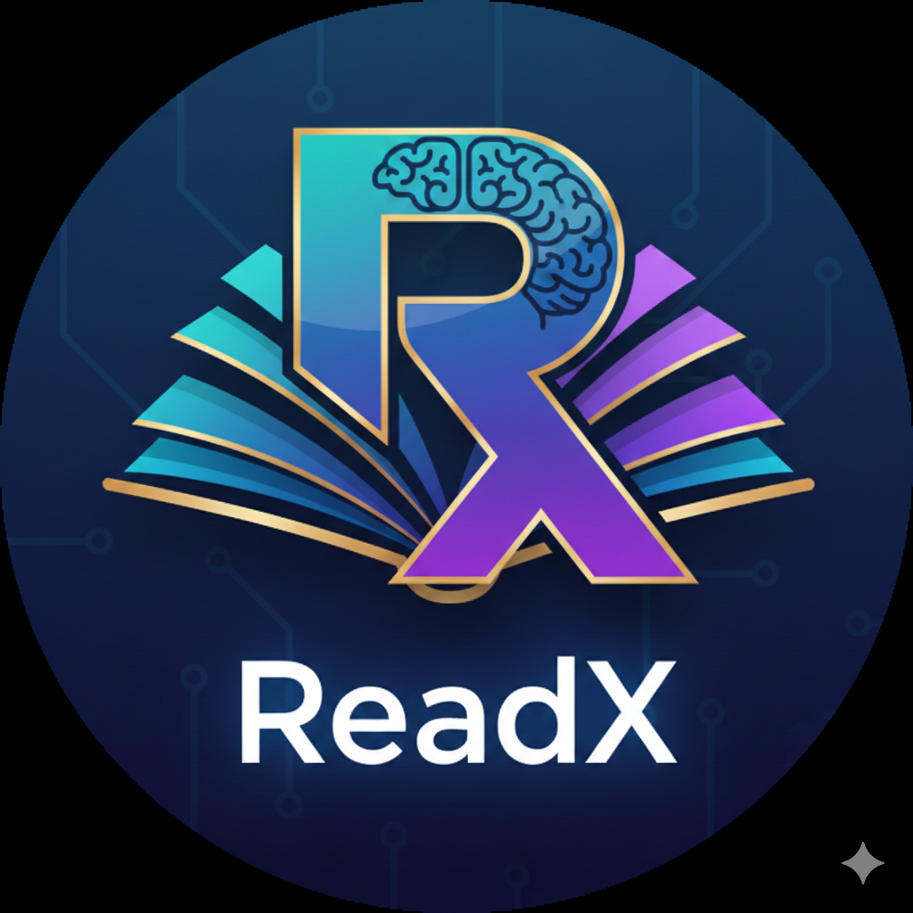
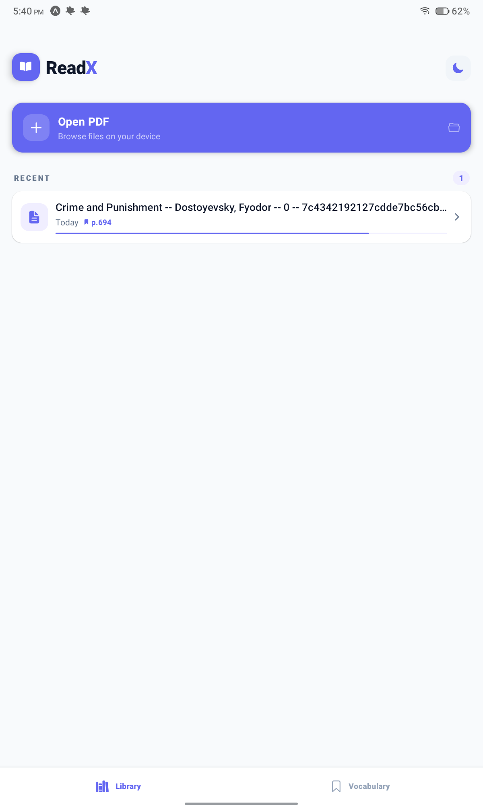
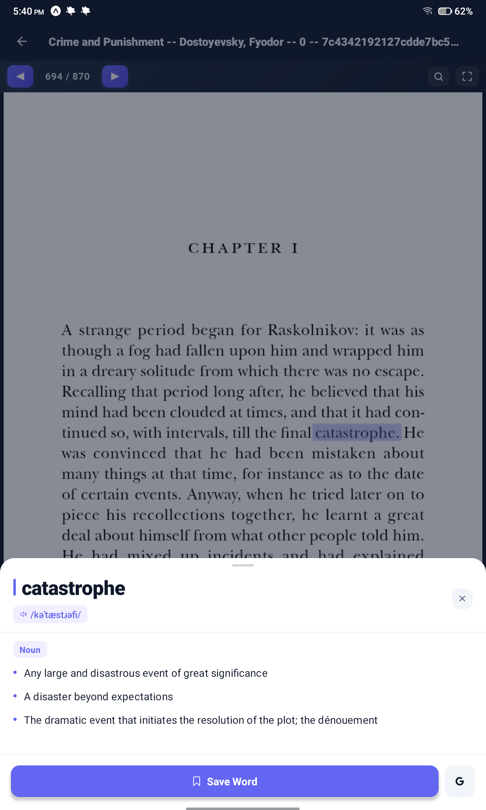

<p align="center">
  
</p>

<h1 align="center">ReadX</h1>

<p align="center">
  <strong>Tap. Read. Learn.</strong><br/>
  Your smart PDF reading companion for Android
</p>

<p align="center">
  
  
  
  
  
</p>

---

## About

**ReadX** is a modern, feature-rich PDF reader built for Android. Upload any PDF, tap on any word to instantly get its definition — perfect for language learners, avid readers, and anyone who loves to expand their vocabulary while reading.

No sign-ups. No subscriptions. Just read and learn.

---

## Features

### Core Reading Experience
- **PDF Upload & Rendering** — Pick any PDF from your device; rendered with **PDF.js** for crisp, accurate text
- **Tap-to-Define** — Tap any word in a PDF to instantly see its definition, phonetics, part of speech, synonyms, and example usage
- **Accurate Word Highlighting** — Canvas-based proportional text measurement ensures perfect highlight accuracy on every word
- **Resume Reading** — Automatically remembers your last page for every document — pick up right where you left off
- **Bidirectional Scrolling** — When resuming, pages load both before and after your last position for seamless navigation

### Smart Tools
- **In-PDF Search** — Full-text search across all pages with match highlighting, result count, and prev/next navigation
- **Progressive Search** — Searches cached pages instantly, then scans remaining pages in the background without freezing the UI
- **Go-to-Page** — Jump to any page instantly with a quick dialog
- **Fullscreen Mode** — Hide all chrome and read distraction-free with a floating restore button

### Vocabulary Builder
- **Save Words** — Bookmark any word with its definition to your personal vocabulary list
- **Vocabulary Tab** — Browse and search all saved words in a beautiful card layout
- **Dictionary Powered** — Uses the [Free Dictionary API](https://dictionaryapi.dev/) — no API keys needed

### Premium UI/UX
- **Animated Splash Screen** — Spring-animated logo, glow effects, and brand reveal on app launch
- **Dark & Light Themes** — Toggle between dark (#0F172A) and light (#F8FAFC) themes; preference persists across sessions
- **Ionicons Throughout** — Consistent, crisp vector icons across every screen
- **Platform-Aware Design** — Proper Android elevation shadows and iOS-style shadows where appropriate
- **Reading Progress** — Visual progress bars and page counts for every document in your library

---

## Screenshots

> *Add your screenshots here*
>
> | Library | PDF Viewer | Word Definition |
> |---------|-----------|-----------------|
> |  |  |  |

---

## Tech Stack

| Layer | Technology |
|-------|-----------|
| **Framework** | React Native 0.77 + Expo SDK 54 |
| **Language** | TypeScript 5.3 |
| **Navigation** | React Navigation 7 (Bottom Tabs + Native Stack) |
| **PDF Rendering** | PDF.js 3.11.174 via WebView |
| **Dictionary** | [Free Dictionary API](https://dictionaryapi.dev/) |
| **Storage** | AsyncStorage (local persistence) |
| **Icons** | Ionicons (@expo/vector-icons) |
| **File Picker** | expo-document-picker |

---

## Project Structure

```
ReadX/
├── App.tsx                          # Root component with splash + navigation
├── index.ts                         # Entry point
├── app.json                         # Expo configuration
├── package.json                     # Dependencies & scripts
├── tsconfig.json                    # TypeScript config
├── assets/                          # App icons & splash assets
└── src/
    ├── components/
    │   ├── SplashScreen.tsx          # Animated boot splash
    │   └── WordModal.tsx             # Bottom sheet word definition modal
    ├── context/
    │   └── ThemeContext.tsx          # Dark/light theme provider
    ├── navigation/
    │   └── AppNavigator.tsx          # Tab + stack navigator setup
    ├── screens/
    │   ├── HomeScreen.tsx            # PDF library & upload
    │   ├── BookmarksScreen.tsx       # Saved vocabulary list
    │   └── PdfViewerScreen.tsx       # WebView PDF renderer
    ├── services/
    │   ├── dictionaryService.ts      # Free Dictionary API integration
    │   └── storageService.ts         # AsyncStorage CRUD operations
    ├── types/
    │   └── index.ts                  # TypeScript interfaces
    └── utils/
        └── pdfHtml.ts               # WebView HTML generation (PDF.js + search + highlights)
```

---

## Getting Started

### Prerequisites

- **Node.js** 18+ (recommended: 20.x)
- **npm** or **yarn**
- **Expo Go** app on your Android device ([Google Play](https://play.google.com/store/apps/details?id=host.exp.exponent))
- Android 7.0+ (API 24+)

### Installation

```bash
# Clone the repository
git clone https://github.com/yourusername/ReadX.git
cd ReadX

# Install dependencies
npm install

# Start the development server
npx expo start
```

### Running on Your Device

1. Open **Expo Go** on your Android phone
2. Scan the QR code shown in the terminal
3. The app will load and you're ready to go!

### Building an APK

```bash
# Install EAS CLI globally
npm install -g eas-cli

# Log in to your Expo account
eas login

# Build a standalone APK
eas build --platform android --profile preview
```

The APK will be available for download from your [Expo dashboard](https://expo.dev) once the build completes.

---

## How It Works

1. **Upload a PDF** — Tap the upload button on the Library screen to pick a PDF from your device
2. **Read** — The PDF is rendered page-by-page using PDF.js inside a WebView with a custom text layer
3. **Tap a Word** — Each word is individually positioned using canvas-based measurement for pixel-perfect tap targets
4. **Get the Definition** — The app queries the Free Dictionary API and displays results in a beautiful bottom sheet
5. **Save to Vocabulary** — Tap the bookmark icon to save any word and its definition for later review
6. **Search** — Use the search icon to find text across all pages with highlighted matches
7. **Resume Anytime** — Your reading position is saved automatically; come back and continue right where you left off

---

## Configuration

| Setting | Location | Default |
|---------|----------|---------|
| App name | `app.json` → `expo.name` | ReadX |
| Theme colors | `src/context/ThemeContext.tsx` | Primary: `#6366F1` (Indigo) |
| Min Android version | `app.json` | API 24 (Android 7.0) |
| PDF.js version | `src/utils/pdfHtml.ts` | 3.11.174 (CDN) |

---

## API Reference

ReadX uses the **Free Dictionary API** — a free, open-source dictionary API with no authentication required.

- **Endpoint:** `https://api.dictionaryapi.dev/api/v2/entries/en/{word}`
- **Rate Limits:** None (fair use)
- **Documentation:** [dictionaryapi.dev](https://dictionaryapi.dev/)

---

## Roadmap

- [ ] Haptic feedback on word tap
- [ ] Swipe-to-delete in library & vocabulary
- [ ] Reading statistics & streaks
- [ ] Text-to-speech pronunciation
- [ ] Vocabulary quiz mode
- [ ] Export vocabulary to CSV/PDF
- [ ] Highlight & annotate passages
- [ ] Multiple dictionary sources
- [ ] Onboarding tutorial
- [ ] iOS support

---

## Contributing

Contributions are welcome! Feel free to open issues or submit pull requests.

1. Fork the repository
2. Create your feature branch (`git checkout -b feature/amazing-feature`)
3. Commit your changes (`git commit -m 'Add amazing feature'`)
4. Push to the branch (`git push origin feature/amazing-feature`)
5. Open a Pull Request

---

## License

This project is licensed under the **MIT License** — see the [LICENSE](LICENSE) file for details.

---

## Acknowledgments

- [Expo](https://expo.dev/) — for the incredible React Native development platform
- [PDF.js](https://mozilla.github.io/pdf.js/) — Mozilla's PDF rendering engine
- [Free Dictionary API](https://dictionaryapi.dev/) — for the free, open dictionary data
- [Ionicons](https://ionic.io/ionicons) — for the beautiful icon set
- [React Navigation](https://reactnavigation.org/) — for seamless navigation

---

<p align="center">
  Built with ❤ by a reader, for readers.
</p>
